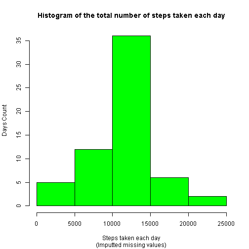

# Reproducible Research: Peer Assessment 1 
#### by J.A (newja1390@gmail.com)
## Introduction
It is now possible to collect a large amount of data about personal movement
using activity monitoring devices. These type of devices are part of the 
“quantified self” movement – a group of enthusiasts who take measurements about
themselves regularly to improve their health, to find patterns in their behavior,
or because they are tech geeks. But these data remain under-utilized both
because the raw data are hard to obtain and there is a lack of statistical 
methods and software for processing and interpreting the data.

This assignment makes use of data from a personal activity monitoring device.
This device collects data at 5 minute intervals through out the day. The data
consists of two months of data from an anonymous individual collected during
the months of October and November, 2012 and include the number of steps taken
in 5 minute intervals each day.

## Data

The data for this assignment can be downloaded from the course web site:

* Dataset: [Activity monitoring data][1] [52K]

The variables included in this dataset are:

* steps: Number of steps taking in a 5-minute interval (missing values are coded as NA)
* date: The date on which the measurement was taken in YYYY-MM-DD format
* interval: Identifier for the 5-minute interval in which measurement was taken

The dataset is stored in a comma-separated-value (CSV) file and there are a total
of 17,568 observations in this dataset.

## Procedure:
--------------------------------------------------------------------------------
### Loading and preprocessing the data

```r
   ### read data from dataset
   unzip(zipfile="activity.zip")
   data <- read.csv("activity.csv")
```
--------------------------------------------------------------------------------
### What is mean total number of steps taken per day?
* Make a histogram of the total number of steps taken each day
* Calculate and report the mean and median total number of steps taken per day

```r
### split the data to steps by day
dateSplit <- split(data, data$date)

### Calculate the total number of steps taken per day
totalStepsPerDay <- sapply(dateSplit, function(x) sum(x[,"steps"],na.rm = TRUE))


### Make a histogram of the total number of steps taken each day
hist(totalStepsPerDay, 
     main="Histogram of the total number of steps taken each day",  
     xlab="Steps taken each day",
     ylab="Days Count",
     col="red")
```

 

```r
### Calculate and report the mean and median of the total number of steps taken per day
mean(totalStepsPerDay)
```

```
## [1] 9354.23
```

```r
median(totalStepsPerDay)
```

```
## [1] 10395
```
--------------------------------------------------------------------------------
### What is the average daily activity pattern?
* Make a time series plot (i.e. type = “l”) of the 5-minute interval (x-axis) and the average number of steps taken, averaged across all days (y-axis)
* Which 5-minute interval, on average across all the days in the dataset, contains the maximum number of steps?


```r
### 1. Making a time series plot of the 5-minute interval(x-axis)and the average number of steps taken, averaged across all days(y-axis)

avgStepsPerInterval <- aggregate(x=list(avgSteps=data$steps),
                                 by=list(interval=data$interval),
                                 FUN=mean, na.rm=TRUE)

### Plot the time-series graph.
## x-axis: Time interval, y-axis: Average number of steps taken all days for each time interval
plot(x=avgStepsPerInterval$interval,y=avgStepsPerInterval$avgSteps,
     main="Average of steps per interval for all days", 
     xlab="Interval",
     ylab="Average of steps per interval", 
     type="l",   
     col="red")


### 2. Which 5-minute interval, on average across all the days in the dataset, contains the maximum number of steps?
max <- max(avgStepsPerInterval$avgSteps, na.rm=TRUE)
index <- as.numeric(which(avgStepsPerInterval$avgSteps == max))
max_avgSteps <- avgStepsPerInterval[index,]

### adds one or more straight lines through the current plot, where the average of steps is max.
abline(h=max_avgSteps$avgSteps ,col="blue", lwd=1)
```

 

```r
### where the average of steps is max:
max_avgSteps
```

```
##     interval avgSteps
## 104      835 206.1698
```
--------------------------------------------------------------------------------
### Imputing missing values

The presence of missing values may introduce bias into some calculations or summaries of the data.
The strategy of Filling in all of the missing values in the dataset is using the mean for day, and the mean for 5-minute interval.


```r
### The presence of missing values may introduce bias into some calculations or summaries of the data.

### The total number of missing values in the dataset(i.e. the total number of rows with NAs)is:
nrow(data) - nrow(na.omit(data))
```

```
## [1] 2304
```

```r
### Filling in all of the missing values in the dataset.
### The strategy is using the mean for day, and the mean for 5-minute interval.

# df<-meanStepsPerDay
# for (i in nrow(data))
# {
#         if(is.na(data[i,"steps"]))
#         {
#           na_date = as.character(data[i,"date"])
#           data[i,"steps"] <- df[which(df$date==na_date),"meanSteps"]                
#         }
# }
# 
# data[!complete.cases(data),]
# d2<-data[is.na(data$steps),]
# d3<-na.omit(data)

### Create a new dataset that is equal to the original dataset but with the missing data filled in
data2<-data
data2[is.na(data$steps),"steps"] <- mean(data2$steps, na.rm = TRUE)

### Make a histogram of the total number of steps taken each day. What is the impact of imputing missing data on the estimates of the total daily number of steps?

### split the new dataset to steps by day
dateSplit <- split(data2, data2$date)

### Calculate the total number of steps taken per day
totalStepsPerDay <- sapply(dateSplit, function(x) sum(x[,"steps"],na.rm = TRUE))

### Make a histogram of the total number of steps taken each day from new dataset
hist(totalStepsPerDay, 
  main="Histogram of the total number of steps taken each day",  
  sub="(Imputted missing values)",
  xlab="Steps taken each day",
  ylab="Days Count",
  col="green")
```

 

```r
### Calculate and report the mean and median total number of steps taken per day. Do these values differ from the estimates from the first part of the assignment? 

### Mean total number of steps taken per day (missing replaced by mean for that interval):
mean(totalStepsPerDay)
```

```
## [1] 10766.19
```

```r
### Median total number of steps taken per day (missing replaced by mean for that interval):
median(totalStepsPerDay)
```

```
## [1] 10766.19
```
--------------------------------------------------------------------------------
### Are there differences in activity patterns between weekdays and weekends?

```r
### 1.Create a new factor variable in the dataset with two levels -- "weekday" and "weekend" indicating whether a given date is a weekday or weekend day.
 
dayType <- factor(c("weekday","weekend"))
data2$day[as.POSIXlt(data2$date)$wday %in% c(1:5) ]<- as.character(dayType[1])
data2$day[as.POSIXlt(data2$date)$wday %in% c(0,6) ]<- as.character(dayType[2])

### 2.Make a panel plot containing a time series plot of the 5-minute interval (x-axis) and the average number of steps taken, averaged across all weekday days or weekend days (y-axis).

### Make a panel plot
par(mfrow = c(2,1))


data3<-data2
### weekdays dataset
data3<-subset(data2,day == as.character(dayType[1]),select=c(date,steps,interval))
avgStepsPerInterval <- aggregate(x=list(avgSteps=data3$steps),
                                 by=list(interval=data3$interval),
                                 FUN=mean, na.rm=TRUE)

### Plot the weekdays time-series graph.
### x-axis:Time interval, y-axis:Average number of steps taken all days for each time interval
plot(x=avgStepsPerInterval$interval,y=avgStepsPerInterval$avgSteps,
     main="weekday - Average of steps per interval for all weekdays", 
     xlab="Interval",
     ylab="Average of steps per interval", 
     type="l",   
     col="blue")

box(which = "figure", lty = '1373', col = 'blue')

### weekends dataset
data3<-subset(data2,day == as.character(dayType[2]),select=c(date,steps,interval))
avgStepsPerInterval <- aggregate(x=list(avgSteps=data3$steps),
                                 by=list(interval=data3$interval),
                                 FUN=mean, na.rm=TRUE)

### Plot the weekends time-series graph
plot(x=avgStepsPerInterval$interval,y=avgStepsPerInterval$avgSteps,
     main="weekend - Average of steps per interval for all weekends", 
     xlab="Interval",
     ylab="Average of steps per interval", 
     type="l",   
     col="yellow")

box(which = "figure", lty = '1373', col = 'blue')
```

 
--------------------------------------------------------------------------------
[1]: https://d396qusza40orc.cloudfront.net/repdata%2Fdata%2Factivity.zip

